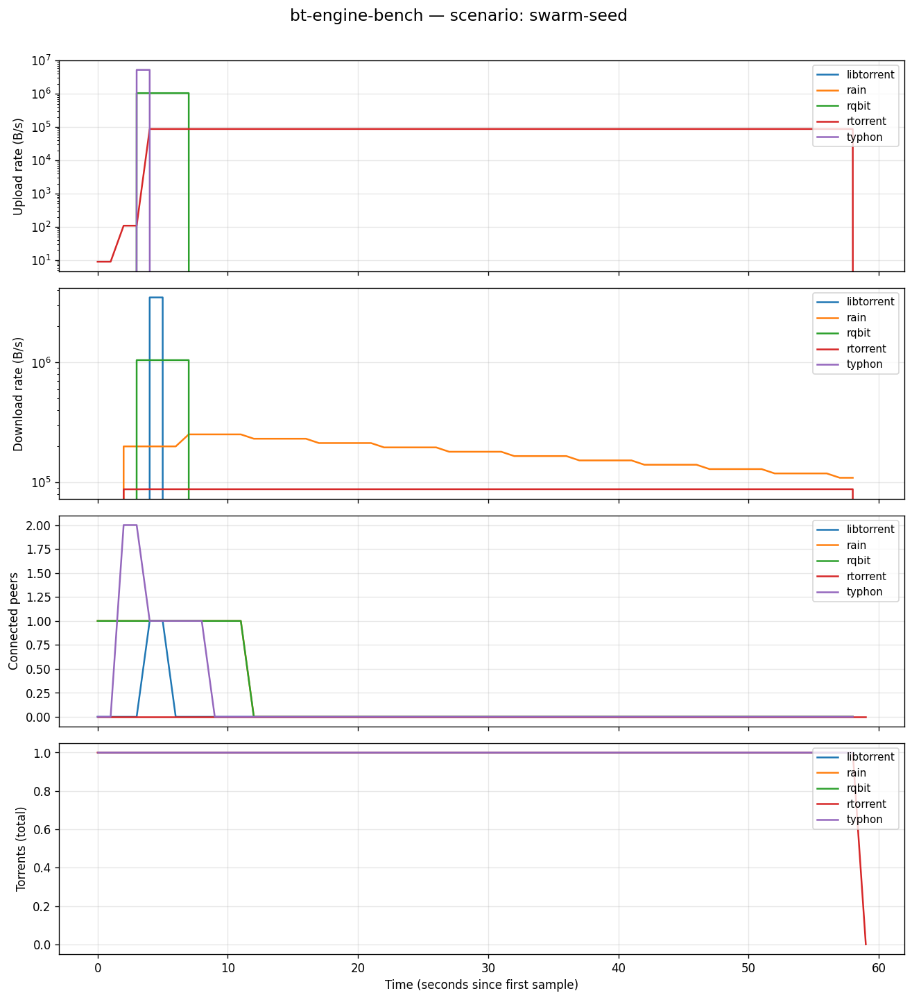

# bt-engine-bench

Cross-engine BitTorrent benchmark harness. Spawns each supported engine
headless via its native RPC, drives an identical workload, and exports
normalised metrics so you can plot apples-to-apples comparisons.

## Why it exists

There is no widely accepted BitTorrent engine benchmark. The "comparisons"
you can find online are forum posts that measure the wrapping client
(UI rendering, storage I/O, queue scheduler) rather than the engine,
or academic papers from 2005-2010 that simulated swarms in tools nobody
runs anymore. None of them touch the workloads that matter to
seedbox-class deployments — thousands of torrents seeded in parallel,
sparse peer activity, sustained throughput over hours.

This harness fills that gap.

## Engines covered

| Engine                            | Language | Concurrency model       | Driver mechanism            |
|-----------------------------------|----------|-------------------------|-----------------------------|
| [typhon](https://github.com/Kheopsian/Hydra) | Rust     | tokio async             | Unix socket JSON-RPC        |
| [rqbit](https://github.com/ikatson/rqbit)    | Rust     | state-machine           | HTTP API                    |
| [rain](https://github.com/cenkalti/rain)     | Go       | 1 goroutine per peer    | HTTP JSON-RPC 2.0           |
| [transmission](https://transmissionbt.com/)  | C        | daemon RPC              | HTTP w/ session-id refresh  |
| libtorrent (via [qBittorrent-nox](https://www.qbittorrent.org/)) | C++ | Boost.Asio | WebUI auth-bypass |
| [rtorrent](https://github.com/jesec/rtorrent) | C++     | xmlrpc-c                | SCGI XML-RPC                |

Every driver has been validated against the real engine — the wire format
documented in the source comments matches what the engine actually emits.

## Status

**Alpha**, publishable. The harness scaffolding is solid:

- All 6 drivers spawn, accept torrents, and report normalised stats
- 6-way idle smoke runs cleanly: each engine produces ~30 samples in a
  single run with consistent CSV schema
- Built-in BEP-3 HTTP tracker handles real announces from real engines
- Torrent generator builds valid `.torrent` files (round-tripped through rqbit)
- **Cross-engine data transfer working** end-to-end across mixed engines.
  Reference 5-engine run (typhon seeds, four leechers): typhon uploads
  10 MiB serving rain + libtorrent + rqbit, rqbit then re-uploads
  another 5 MiB to the rest of the swarm.



```
engine           UL total     DL total
libtorrent          0.0 B      5.0 MiB
rain                0.0 B      5.0 MiB
rqbit             5.0 MiB      5.0 MiB    ← re-upload to swarm
rtorrent            0.0 B        0.0 B    ← see Pending
typhon           10.0 MiB        0.0 B    ← seeder
```

**Pending** (PRs welcome):

- rtorrent participates as a peer in the tracker view but never starts
  data transfer in our scenarios. Likely a tracker-handshake or
  choking config issue specific to rtorrent's defaults. The driver
  spawns clean and accepts torrents; the gap is in the engine-side
  config our `-n` minimal rc skips.
- transmission still uses Docker bridge networking. The other four
  container drivers (rqbit, qbit-nox, rtorrent) are now `--network
  host`. Refactoring transmission needs touching its `settings.json`
  generation pre-spawn since the linuxserver image regenerates the
  conf on first boot.
- `seed_mode` is wired through `TorrentSpec.Seed` and honoured by
  typhon. libtorrent (qbit-nox) has the same flag and just needs the
  driver to forward it.

## Quick start

```sh
# Build the harness binary.
go build -o bench ./cmd/bench

# Acquire engine binaries and images. typhon and rain need binary paths;
# the rest are pulled as Docker images on first run.
docker pull ikatson/rqbit:latest
docker pull linuxserver/transmission:latest
docker pull linuxserver/qbittorrent:latest
docker pull jesec/rtorrent:latest

# Run the 30-second idle smoke across all six engines.
./bench compare \
  --engines typhon,rqbit,transmission,libtorrent,rain,rtorrent \
  --scenario scenarios/smoke.json \
  --output run.csv \
  --typhon-bin /path/to/hydra-engine \
  --rain-bin /path/to/rain

# Plot the result.
pip install -r scripts/requirements.txt
python scripts/plot.py run.csv run.png
```

## Generating synthetic torrents

The harness ships a `gentorrent` helper for hand-built scenarios:

```sh
./bench gentorrent --random 10485760 --out 10mb.torrent --announce http://localhost:6969/announce
```

Inside scenarios (`scenarios/swarm-seed.json` is the reference example),
declare a synthetic swarm and let the runner build everything at run start:

```json
{
  "name": "10mb-typhon-seeds-everyone-leeches",
  "duration": "120s",
  "sample_interval": "1s",
  "tracker": "builtin",
  "swarm": [
    { "payload_size": 10485760, "seeders": ["typhon"] }
  ]
}
```

## Architecture

```
cmd/bench/main.go              CLI: compare, gentorrent
internal/
  engine/                      Driver interface + 6 implementations
  scenario/                    JSON scenario format
  runner/                      Orchestrates Start → AddTorrent → sample → Stop
  metrics/                     Flat-CSV writer with stable schema
  bencode/                     Minimal encoder (.torrent is bencoded)
  torrentgen/                  Builds .torrent files from a payload
  tracker/                     In-process BEP-3 HTTP tracker
scripts/
  plot.py                      pandas + matplotlib summariser
scenarios/                     Example scenario JSON files
```

Driver selection is closed over by `cmd/bench/main.go`. Adding a new engine
is a single file in `internal/engine/`, an entry in the `--engines` switch,
and a smoke test against the real engine.

## Design choices

**JSON, not YAML, for scenarios.** stdlib only, no parser dependency.

**One CSV per run.** Multiple engines share the file with an `engine` column.
Mixing scenarios in one CSV is supported via the `scenario` column. Plot
scripts split on those columns.

**Driver isolation.** Each engine gets its own data dir and listen port.
No two drivers share storage, ports, or peer pools — comparisons stay
unaffected by accidental cooperation.

**Engines own their config.** The harness exposes a small `StartConfig`
(data dir, listen port, on/off toggles for DHT/PEX/LSD, peer caps).
Anything beyond that is the engine's default. This avoids the trap where
the bench surreptitiously tunes one engine more aggressively than another.

## License

MIT. See `LICENSE`.
